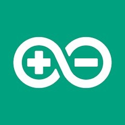

  

<h1 align="center">ioBroker.zendure-ip</h1>

  Local Zendure polling adapter for ioBroker with optional HEMS aggregation.

  
  
  

> [!IMPORTANT]
> This adapter polls Zendure devices locally via `http://<ip>/properties/report` and stores a curated state set instead of dumping the full raw JSON into dozens of unnecessary objects.

> [!NOTE]
> This adapter is **read-only**. It does not control Zendure devices; it reads data and generates daily counters.  
> For full control features, the recommended adapter is **nograx' Zendure adapter**: `https://github.com/nograx/ioBroker.zendure-solarflow`

##  Features

- Poll up to **10 Zendure devices** locally
- Device name becomes the folder name under the adapter namespace
- Spaces in device names are converted to `-`
- Curated device states based on the provided per-device script set
- Optional **HEMS** object tree for devices marked with **Device is in HEMS**
- Per-device daily counters under `device-name/today`
- Aggregated daily counters under `HEMS/today`

##  Device objects

Each device gets a compact state set such as:

- `product`, `serial`, `messageId`, `timestamp`
- `soc`
- `acPowerW`, `acDirectionW`, `acChargingW`, `acDischargingW`
- `solarInputPower`, `solarPower1..4`
- `outputPackPower`, `packInputPower`, `outputHomePower`, `gridInputPower`
- `minSocPct`, `socSetPct`
- `packNum`
- `online`, `lastUpdate`, `ageSec`, `stale`, `rssi`, `lastError`, `rawJson`
- `deviceIsInHems`

###  Removed on purpose

To keep the object tree clean, these are not created anymore:

- `version`
- `minSocRaw`
- `socSetRaw`
- `smartMode`
- `inHems`
- `socLimit`
- `wearLevelPct`

##  Daily counters

###  Per device

Under `device-name/today`:

- `acImportTodayKWh`
- `acExportTodayKWh`
- for `2400pro` also `pvToBatteryTodayKWh`

###  HEMS aggregate

Under `HEMS/today`:

- `acImportTodayKWh`
- `acExportTodayKWh`
- `pvToBatteryTodayKWh`

##  Configuration

The adapter configuration page is intentionally small:

- **Device name**
- **IP address**
- **Interval (s)**
- **Device is in HEMS**

##  Notes

- The adapter is designed for **local readout only**
- No write/control commands are sent to Zendure devices
- HEMS aggregation is built from the devices you explicitly mark with **Device is in HEMS**

##  License

MIT
